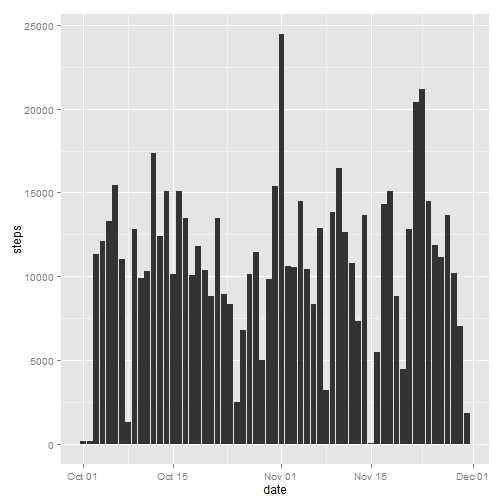
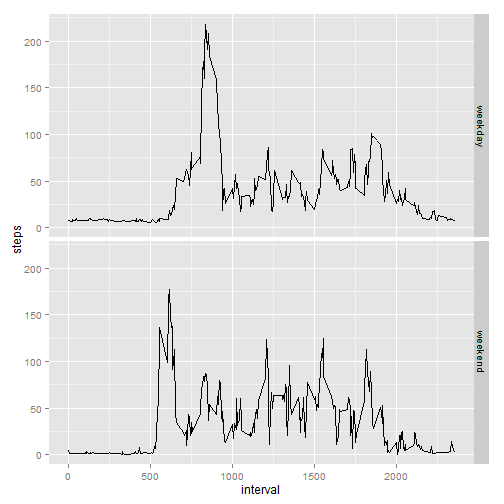

If you haven't done so already, install lubridate, ggplot2, grid and gridExtra packages using:
```
install.packages("lubridate")
install.packages("ggplot2")
```

## Loading and preprocessing the data

```r
library(lubridate)
library(ggplot2)

zip_file<-"activity.zip"
activity_data_file<-"activity.csv"
unzip(zip_file,junkpaths=TRUE)
activity_data<-read.csv(activity_data_file,header=TRUE,na.strings="NA")
activity_data$date<-as.Date(ymd(activity_data$date))
```

## What is mean total number of steps taken per day?
1. Calculate the total number of steps taken per day

```r
activity_data_per_day<-aggregate(activity_data['steps'],activity_data['date'],FUN=sum)
```

2. Make a histogram of the total number of steps taken each day

```r
ggplot(data=activity_data_per_day)+geom_histogram(aes(x=date,y=steps),stat="identity")
```

 

3. Calculate and report the mean and median of the total number of steps taken per day  


```r
mean_steps_per_day<-sapply(activity_data_per_day['steps'],mean,na.rm=TRUE)
```
*The mean total number of steps taken per day is 10766.19.*


```r
median_steps_per_day<-sapply(activity_data_per_day['steps'],median,na.rm=TRUE)
```
*The median total number of steps taken per day is 10765.*


## What is the average daily activity pattern?
1. Make a time series plot (i.e. type = "l") of the 5-minute interval (x-axis) and the average number of steps taken, averaged across all days (y-axis)

```r
mean_steps_per_interval<-aggregate(steps ~ interval,activity_data,FUN=mean,na.rm=TRUE)
ggplot(data=mean_steps_per_interval)+geom_line(aes(x=interval,y=steps))
```

 

2. Which 5-minute interval, on average across all the days in the dataset, contains the maximum number of steps?  
*The interval with the maximum number of steps, on average, is 835.*

## Imputing missing values
1. Calculate and report the total number of missing values in the dataset (i.e. the total number of rows with NAs)

```r
number_of_missing_steps<-sum(is.na(activity_data[,'steps']))
```
*2304 rows are missing steps.*

2. Devise a strategy for filling in all of the missing values in the dataset. The strategy does not need to be sophisticated. For example, you could use the mean/median for that day, or the mean for that 5-minute interval, etc.

*Missing values will be replaced with the mean of that variable for the same interval.*

3. Create a new dataset that is equal to the original dataset but with the missing data filled in.

```r
activity_data_na_indices<-which(is.na(activity_data[,'steps']))
intervals<-data.frame(interval=activity_data[activity_data_na_indices,'interval'])
merged<-merge(x=intervals,y=mean_steps_per_interval)
activity_data[activity_data_na_indices,'steps']<-merged[,'steps']
```

4. Make a histogram of the total number of steps taken each day and Calculate and report the mean and median total number of steps taken per day. Do these values differ from the estimates from the first part of the assignment? What is the impact of imputing missing data on the estimates of the total daily number of steps?

```r
activity_data_per_day<-aggregate(activity_data['steps'],activity_data['date'],FUN=sum)
ggplot(data=activity_data_per_day)+geom_histogram(aes(x=date,y=steps),stat="identity")
```

 


```r
mean_steps_per_day<-sapply(activity_data_per_day['steps'],mean,na.rm=TRUE)
```
*The mean total number of steps taken per day is 10766.19.*


```r
median_steps_per_day<-sapply(activity_data_per_day['steps'],median,na.rm=TRUE)
```

*The median total number of steps taken per day is 11015.00.*

*Yes, many of the estimates have increased although the mean has remained the same (since the mean was used to populate the values.)*

## Are there differences in activity patterns between weekdays and weekends?
1. Create a new factor variable in the dataset with two levels - "weekday" and "weekend" indicating whether a given date is a weekday or weekend day.

```r
# Make a map to convert wday to a day type (weekend or weekday)
map_of_wday_to_daytype<-data.frame(wday=c(1:7),daytype=c('weekend',rep('weekday',5),'weekend'))
map_of_wday_to_daytype$daytype<-factor(map_of_wday_to_daytype$daytype)
# Convert the current dates to day types and add them to the data
merged<-merge(x=list(wday=wday(activity_data$date)),y=map_of_wday_to_daytype)
activity_data$daytype<-merged$daytype
```

2. Make a panel plot containing a time series plot (i.e. type = "l") of the 5-minute interval (x-axis) and the average number of steps taken, averaged across all weekday days or weekend days (y-axis). See the README file in the GitHub repository to see an example of what this plot should look like using simulated data.

```r
mean_steps_per_interval<-aggregate(steps ~ daytype+interval,activity_data,FUN=mean,na.rm=TRUE)
ggplot(mean_steps_per_interval,aes(x=interval,y=steps))+
    geom_line()+
    facet_grid(daytype ~ .)
```

 
